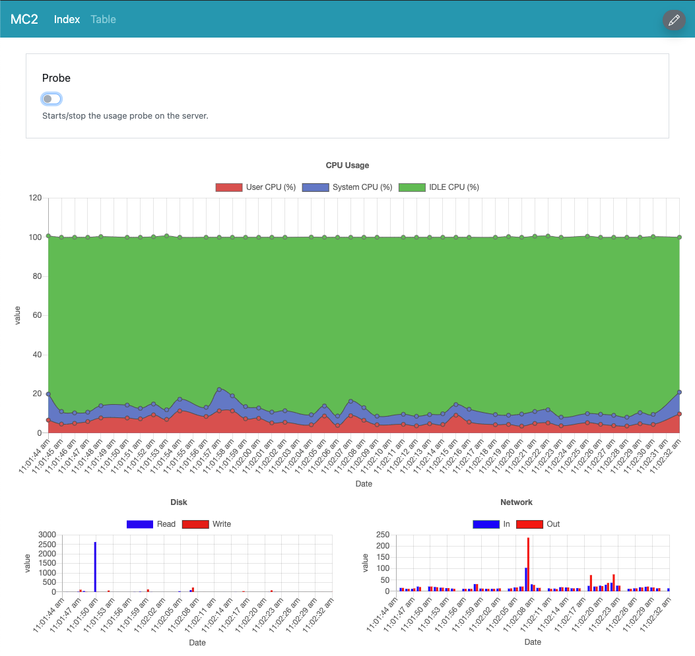

# MC2

MC2 is a small tool that aims at measuring, vizualizing, and storing resources (and ultimately energy) consumption data.

It comes with a simple probe software that runs standard commands (so far, the `top` command) and parses the output to send it to a web client using Web Sockets.

The client displays graphs of resource consumption and will save the data in a database.



## Getting started

### Requirements and warnings

MC2 is work in progress.

You will need Java 15 to run the probe and an OS where the standard ``top`` command is installed. It has been tested under MacOS and should work on Linux, but it may require adaptations for Windows since the ``top`` output command looks different (contributions are welcome).


### Run the probe


```
% java -jar mc2-probe/dist/mc2-probe-0.1-SNAPSHOT-jar-with-dependencies.jar
```

Note that the probe will start an HTTP & Web Socket server on port 8091.

### Connect to the probe with the UI

The UI uses the DLite low code platform to run. You will find the UI descriptor in ``mc2-client/mc2/mc2.dlite``.

To run it, just go to https://ui.dlite.io and connect to the probe by typing its URL (for instance ``localhost:8091`` for a probe started on your local machine).

### Save the data

TBD. (work in progress) 


 


 
